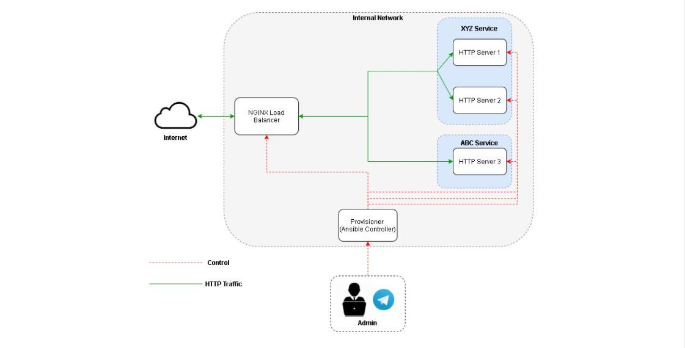

# Provisioning & Server Automation Using Ansible 

ET4044 Network Automation & Software Defined Networking final project.

## Description

This repository consists of Ansible playbook and roles for deploying NGINX Load Balancer and simple backend application.

## Getting Started

### Scenario

Our main objectives are:
* Install and deploy service configuration in each server accordingly using Ansible
    - NGINX server acts as a load balancer that route incoming traffic from the internet to the backend. 
    - There are 2 backend services, XYZ Service and ABC Service.
    - Provisioner server acts as Ansible Controller
* Create service health check using Ansible
    - The health check if performed to make sure all of the services is always up. It will automatically restart the service when the service is unhealthy/down
    - If the services is unhealthy/down, Provisioner server will send a notification to Telegram Bot.

### Requirement
- OS Ubuntu Server 18.04 
- Ansible 
- Telegram Bot

